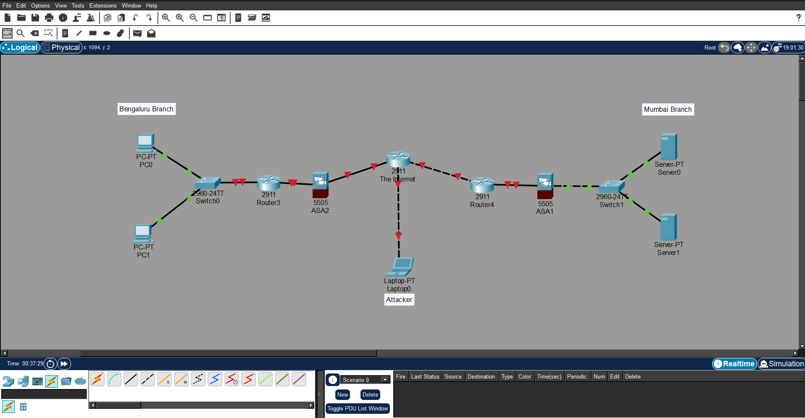

# Lab 01 - Enterprise Network

## Objective
Design an enterprise network using Cisco Packet Tracer.

## Topology

## Devices
- 3 Cisco 2911 Routers
- 2 Cisco 2960 Switches
- 2 Cisco ASA 5505 Firewalls
- 2 PCs
- 2 Servers
- 1 Laptop (Attacker)

## Files
- Enterprise-Network.pkt
- topology.png

## Status
Topology Completed
